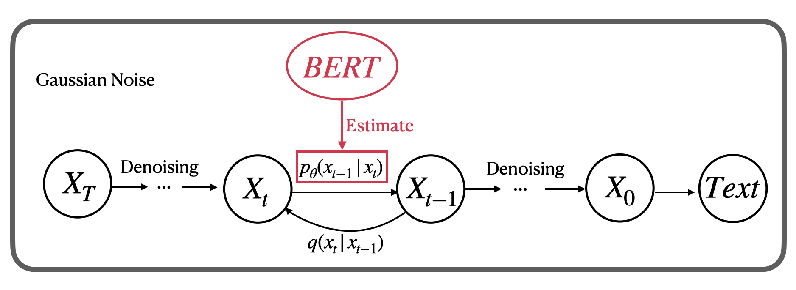
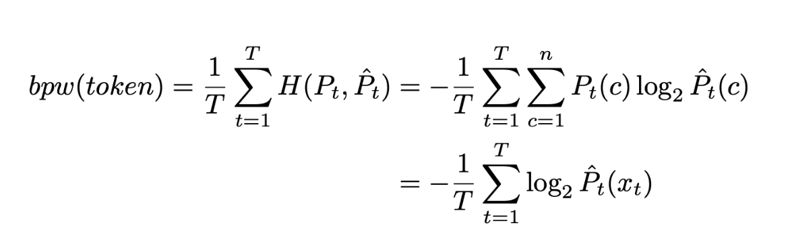

# Generating Piano Sounds Using DiffusionLM

**Collaborators:** [Chuhan Li](https://github.com/LeeChuh) and [Ruiqi Liu](https://github.com/RRQLiu) 

**Note:** This is our semester-long research project for Boston University's Fall 2022 course - `CAS CS 523: Deep Learning` taught by Professor Iddo Drori. 

This repository contains the implementation of our project. Inspired by the recent adaptation of language models to generate audio and music, we explored an innovative way to adapt Diffusion Language Models (`Diffusion-LM`) to produce piano sounds. Capitalizing on the characteristic features of diffusion language models to generate structured sequential data, we used `Diffusion-LM` to produce music by placing it in the discrete music domain. Through the use of `MIDI` representation of music, we were effectively able to train our models and generate music. In our project, we explored both `BERT` and `Electra-BERT` as base networks for the generative model.

## Contents:
- [Introduction](#Introduction)
- [Data](#Data)
- [Methodology](#Methodology)
- [Results](#Results)
- [Sample Output](#Sample-Output)

### Introduction:

We propose adapting the Diffusion-LM language model to generate piano sounds using symbolic representations of music (i.e, `MIDI` files). By leveraging on the sequential nature of music tokens, the project aims to generate new compositions by studying this nature of music. Our approach involves encoding MIDI symbols into text sequences for compatibility with Diffusion-LM. Additionally, we explore the integration of different transformer models like `BERT` and `ELECTRA-BERT` within Diffusion-LM to assess their impact on music quality, rhythm, overfitting, and optimization. This project combines language models, symbolic music, and transformers to push the boundaries of audio generation.

### Data:

We used the `Lakh Large MIDI dataset`, which is a collection of over 10,000 piano MIDI files. This data can be downloaded from [here](https://colinraffel.com/projects/lmd/#get). This dataset was then pre-processed and tokenized to generate sequences of musical notation in a text format, which our model could learn and then generate the required tokens. We utilized a token encoding system inspired by the mmmtrack encoding system to parse the information contained in the MIDI file to an appropriate sequential representation. We extracted the information regarding pitch, velocity, and duration of each note and then parsed it to a text file using the encoding- $p\square\square$, $v\square\square$, and $d\square\square$, where $\square$ denotes the placeholder to represent the note's pitch, velocity, and duration, respectively. If there are multiple notes appearing simultaneously, we "*compressed*" them and made them a series of notations. 

### Methodology:

Our project employs a novel approach of training a Diffusion-LM model on MIDI files using `BERT` transformer model and `Electra-BERT` to generate discrete music. Here are the detailed steps:

1. **Data Preparation**: Our dataset is composed of MIDI files from the Lakh MIDI dataset. The MIDI files are transposed into a unified key to reduce the complexity of the model's training.

2. **Preprocessing**: The MIDI files are then converted into text using the python MIDI library. This library translates the MIDI files into a sequence of musical events such as note-on, note-off, time-shifts etc. Each of these events are then encoded into a unique token, and the sequences of these tokens form the input data for our model.

3. **Model Training**: We train a Diffusion Language Model (Diffusion-LM) on the tokenized MIDI data. The Diffusion-LM model is built upon a `BERT` transformer model, where the transformer is used to parameterize a Gaussian diffusion process. The transformer takes the raw MIDI tokens as input, and produces as output a distribution over next tokens, from which a token is sampled and fed into the next step of the transformer. The model is trained with forward and reverse steps to optimize the likelihood of the generated music.

4. **Evaluation**: The quality of the music generated by the model is evaluated using bit-per-word (bpw) metric. The bpw measures the frequency of the generated sentences, assuming that a sentence with less-frequent words is more difficult to generate.

5. **MIDI and Waveform Visualization**: The generated MIDI files are visualized using MIDI visualization tools and waveforms are used to show the timing and duration of notes in the music.

### Sample-Output

https://github.com/LeeChuh/DiffusionLM_MIDI_Generator/assets/60937990/a5be22c7-ba96-4c07-8598-240d3c29eb75

https://github.com/LeeChuh/DiffusionLM_MIDI_Generator/assets/60937990/3962d9c7-6d59-4e00-b1a9-ea450ac945bf

https://github.com/LeeChuh/DiffusionLM_MIDI_Generator/assets/60937990/0e867d77-fdc4-4359-9130-b289966b255f

https://github.com/LeeChuh/DiffusionLM_MIDI_Generator/assets/60937990/4e9a4315-e4d1-4361-af4f-b3fcc62989c0
